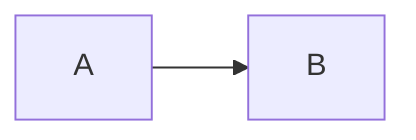

# Agent Instructions

This document provides context and guidelines for AI agents working on the
sudo-overclock project.

## Project Overview

This is an engineering blog built with modern web technologies. The architecture
separates content compilation from the application layer.

## Key Architectural Decisions

### Project Layout

The codebase follows a DDD-inspired, layered module structure. Every module has
the same internal shape so refactoring and module extraction stay predictable.

```
src/
  app/                  # Composition root (Next.js App Router routes)
                        # ONLY assembles pages from module presentation.
                        # No business logic, no direct module access.
  shared/               # Cross-cutting primitives, no domain knowledge
    ui/                 # Reusable, themable UI primitives (Button, Heading…)
                        #   Each in its own kebab-case folder with co-located
                        #   .module.css. NO barrel files.
    lib/                # Framework-agnostic helpers (polymorphic, DI context…)
  modules/
    <module-name>/
      domain/           # Pure types, value objects, domain events.
                        # No imports outside the module.
      application/      # Use cases, application services, ports.
                        #   ports/  — interfaces for adapters the module needs
                        #              from the outside (persistence, peers).
                        # May import shared/ + own domain/.
      infrastructure/   # Concrete adapters (compiler, file IO, peer bindings).
                        # May import shared/ + own domain/ + own application/.
      presentation/     # React components rendered by app/.
                        # May import shared/ + own application/ + own domain/.
                        # NEVER imports own infrastructure/ — gets it via DI.
      content/          # (Optional) module-owned resources:
                          content/raw/      — source markdown
                          content/compiled/ — generated TS
```

### Module Boundaries (DDD / Clean Architecture)

- **Inner layers never import outer layers.** `domain/` is the most inner,
  `presentation/` is the most outer. Cross-layer arrows point inward only.
- **Peer modules do NOT import each other directly.** Module A talks to Module B
  via B's `application/ports/` interface. B's `infrastructure/` provides the
  adapter. The composition root (`app/`) wires the actual implementation in.
- **Boundaries are enforced by `oxlint`'s `no-restricted-imports`** with a
  per-folder override. See `oxlint.config.ts`.

### Naming

- **Folders and component files use kebab-case.** A component lives in
  `shared/ui/<kebab-name>.tsx` with a co-located `<kebab-name>.module.css`. The
  flat layout keeps path aliases short (`@repo/shared/ui/button` resolves to a
  single file via a wildcard `paths` entry). Use a sub-folder only when the
  component has sub-files (e.g. multiple variants).
- **Component identifiers are PascalCase** in code (`Button`, `Heading`) even
  though the file is kebab-case (`button.tsx`).
- **No barrel files** (`index.ts`) except where an interface boundary actually
  needs one (e.g. a module's public API surface to other modules).
- **Aliases are scoped:**
  - `@repo/app/*` → `./src/app/*`
  - `@repo/shared/*` → `./src/shared/*`
  - `@repo/modules/*` → `./src/modules/*`
  - `@repo/compiler` → `./src/modules/blog/infrastructure/compiler/index.ts`
    (preserved for back-compat with the old contract; eventually points at the
    compiled content module.)
- **Inside a module, use relative imports** (`./types`, `../domain/post.ts`).
  This makes refactors and module extraction trivial — moving the folder keeps
  inner imports intact.
- **The `shared/` layer is the exception.** Files inside `src/shared/**` may
  only reference each other through aliases (`@repo/shared/lib/cx`,
  `@repo/shared/ui/button`). The internal `lib/` ↔ `ui/` boundary is treated as
  a cross-package reference: components always import helpers via the alias,
  never via `../lib/...`. This keeps `shared/` portable — extracting it into a
  separate package is mechanical.
- **Across module layers, use relative imports too** — never reach for an alias
  from inside a module. Cross-module references go through aliases.

### Dependency Injection

A small `shared/lib/create-context.ts` exports `createContext<T>()` that
produces a typed React context plus a `useContext` hook. Modules declare ports
(TS interfaces) in `application/ports.ts`; consumers in `presentation/` pull
implementations through context. The composition root in `app/` is the only
place that knows about concrete implementations.

### Content Pipeline

The project uses a two-stage content pipeline, owned by `modules/blog/`:

1. **Raw Content** (`modules/blog/content/raw/**/*.md`) — source markdown.
2. **Compiled Content** (`modules/blog/content/compiled/`) — structured,
   processed content ready for consumption.

The compiler lives at `modules/blog/infrastructure/compiler/` and uses
Unified.js, Rehype, and Remark plugins. It is invoked from `app/` or from a
build-time script and writes to `modules/blog/content/compiled/`.

### Assets, Code Blocks, and Mermaid

**Images, fonts, and any binary asset** the markdown needs are co-located with
the post:

```
modules/blog/content/raw/
  hello-world/
    hello-world.md
    diagram.png
    hero.svg
  another-post/
    another-post.md
```

In markdown, reference them with relative paths:

```md

```

The compiler resolves `./diagram.png` against the post's directory, copies the
file into Next.js's `public/posts/<slug>/`, and rewrites the `` `src` to
its public URL (`/posts/<slug>/diagram.png`). Authors never touch `public/`
directly — the compiler owns that.

**Code blocks** are highlighted at build time by **Shiki**, with a custom theme
derived from our token palette (green-mono). Output is static HTML — zero
runtime JS for the highlight itself.

**Mermaid diagrams** are written inside a fenced code block:

````md

````

The compiler detects `mermaid` (and `mermaid-v2`) languages, renders them to
inline SVG at build time, and embeds `<title>` / `<desc>` for accessibility. No
runtime mermaid library, no client-side hydration.

If a renderer cannot produce SVG (e.g. malformed syntax), the compiler falls
back to a `<pre><code>` block so the author can still debug the source.

### Token Naming

CSS custom properties follow Tailwind v4's token shape and live in the `@theme`
block in `src/app/globals.css`. The `--color-*`, `--font-*`, `--spacing-*`,
`--radius-*`, `--shadow-*` namespace mirrors Tailwind's utility API; primitive
hues use `--color-<hue>-<step>` (e.g. `--color-phosphor-500`).

There is no `--token-*` prefix. The token system itself is the single source of
truth.

Components in `shared/ui/**` and `modules/*/presentation/**` consume semantic
tokens directly via `var(--color-phosphor)` etc. Hex colors and ad-hoc values
belong in `globals.css` only.

### Component Conventions

- **Shared primitives live in `src/shared/ui/<kebab>.tsx`** with a co-located
  `<kebab>.module.css`. Module-scoped components live in
  `src/modules/<x>/presentation/`. App routes live in `src/app/`.
- Components reference **semantic tokens** (`--color-phosphor`,
  `--color-foreground`) in their CSS Modules. They never inline hex.
- Variant props (`variant="primary" | "ghost"`) map to CSS Module classes
  composed with **`clsx`**. Lookup the existing `@base-ui/react` usage pattern
  in `shared/ui/button.tsx` for the template.
- **Variant and size classes override local CSS custom properties — they never
  duplicate property declarations.** The base class declares every property
  exactly once and consumes the local variables; each variant/size class only
  sets those variables. This keeps states (`:hover`, `:active`) and layout
  centralized so adding a new variant means setting a handful of variables, not
  re-declaring the whole rule set:

  ```css
  .heading {
    font-size: var(--heading-size);
    line-height: var(--heading-line-height);
    color: var(--heading-color);
  }

  .sizeH1 {
    --heading-size: var(--typography-h1-size);
    --heading-line-height: var(--typography-h1-leading);
  }

  .variantPhosphor {
    --heading-color: var(--color-phosphor);
  }
  ```
- **Every HTML layer that exposes a `className` hook carries a
  `data-slot="<name>"` attribute.** Selectors in CSS Modules use that attribute
  (e.g. `&[data-slot="leader"]`). Slots make it possible for consumers to reach
  in via global styles without descending into a component's internals.
- CSS Module imports return `string | undefined` per key (because of
  `noUncheckedIndexedAccess`). `clsx` accepts `undefined` directly, so **do
  not** defensively write `styles.foo ?? ""` — pass the value straight into
  `clsx(styles.foo, …)`.
- Button affordance text uses ASCII brackets: `[ read more ]`, `[ ok ]`.

### Styling Strategy

- **Tailwind CSS** - Used ONLY for design tokens and CSS variables, not for
  utility classes
- **CSS Modules** - Primary styling solution for components
- **BaseUI** - Component library for UI primitives

### Static Generation

Next.js is configured for Static Site Generation (SSG). All blog content is
pre-rendered at build time.

## Development Guidelines

### Code Quality

- Run `pnpm check:lint` before committing to verify TypeScript types, oxlint
  rules, and oxfmt formatting
- Run `pnpm test` to execute the test suite
- Use `pnpm format` to auto-fix formatting issues

### Module Boundaries

The project enforces strict module boundaries:

- `app/` is the composition root. It composes routes from
  `modules/*/presentation/` and may import from `@shared/*`. It does NOT import
  `modules/*/domain/`, `application/`, or `infrastructure/` directly.
- `shared/` has no domain knowledge. It imports nothing from `modules/`.
- `modules/<x>/domain/` imports nothing outside the module.
- `modules/<x>/application/` may import `shared/` and own `domain/`. It may
  declare **ports** (TS interfaces) under `application/ports/` for any external
  dependency (persistence, peer modules, time, randomness).
- `modules/<x>/infrastructure/` provides the concrete adapters that satisfy the
  ports. It may import `shared/`, own `domain/`, own `application/`, AND it may
  bind to peer modules through their `application/ports/` — never by reaching
  into a peer's `infrastructure/` or `presentation/`.
- `modules/<x>/presentation/` consumes the application services (and
  context-injected adapters) to render React components. It NEVER imports its
  own `infrastructure/` directly — the composition root wires the adapter into
  the provider.
- `modules/<x>/content/` (when present) is owned by that module. Markdown goes
  in `content/raw/`, generated artifacts in `content/compiled/`.

### Circular Dependencies

The project uses oxlint's `import/no-cycle` rule to detect circular dependencies
as part of `pnpm check:lint`.

## Common Tasks

### Adding a New Blog Post

1. Create a markdown file in `modules/blog/content/raw/`
2. Run the compiler to generate structured content in
   `modules/blog/content/compiled/`
3. The Next.js app will automatically pick up the new content during build

### Modifying the Compiler

1. Update logic in `modules/blog/infrastructure/compiler/`
2. Ensure changes don't break the contract with `app/` and
   `modules/blog/application/`
3. Run tests and linting to verify

### Updating Components

1. Shared primitives live in `shared/ui/<kebab>.tsx`. Module-scoped components
   live in `modules/<x>/presentation/`. App routes live in `app/`.
2. Use CSS Modules for styling. Reference tokens via `var(--*)`.
3. Components consume their dependencies via context (typed via
   `shared/lib/create-context.ts`) — never by importing sibling
   `infrastructure/` directly.

## Testing Strategy

- Unit tests for compiler logic
- Integration tests for content pipeline
- Component tests for React components
- No E2E tests (static site)

## Performance Considerations

- All content is pre-rendered (SSG)
- Optimize images during compilation
- Code-split components where appropriate
- Minimize client-side JavaScript

---

## Design Language & Visual Identity

This site has two roles — **engineering blog** and **portfolio / about-me**. The
visual identity must serve both without compromise: legible enough to read for
twenty minutes straight, distinctive enough to be remembered after one visit.
The direction is a **CRT-phosphor, ASCII-chrome, monospace, cyberpunk**
aesthetic — the kind of screen a fictional 1980s hacker would stare at, but
rendered with modern browser technology.

### Pillars

1. **One typeface, one rhythm.** JetBrains Mono everywhere — prose, UI,
   headings, buttons. No pairing. Single family keeps the page feeling cohesive
   and intensifies the terminal aesthetic.
2. **Mono palette with phosphor accent.** Background and foreground use neutral
   scale only. The single accent color is **phosphor green**
   (`--color-phosphor`, `#00ff9c`). Brand/positive/negative/warn/info roles map
   to neutrals + opacity so the screen reads as one phosphor-tinted display.
   Headings and code use brighter green; body uses neutral.
3. **Pixel-precise layout.** Body sizes are integer-line-height ratios. All
   spacing is a multiple of `var(--spacing)` (4 px). Borders are 1 px solid —
   never feathery. Box shadows are subtle phosphor glow, not soft drop shadows.
   Rounded radii are small (`--radius-sm`/`--radius-md`); pill shapes reserved
   for status chips.
4. **CRT phosphor glow.** Headings emit a low-alpha green glow
   (`text-shadow: 0 0 6px var(--color-phosphor-glow)`). Hero areas and large
   quotes optionally render a soft scanline overlay via
   `repeating-linear-gradient`. Focus rings are double-layered: a 1 px solid
   phosphor ring with a faint outer glow. **Scanlines** are a CSS gradient
   overlay applied via a dedicated `.scanlines` utility — never an image.
   **Noise** is generated via inline SVG `<feTurbulence>` referenced through
   `background-image: url(...)`; no PNG/JPG assets. Noise strength is
   `--noise-strength` (0 = off, default 0.04) and respects
   `prefers-color-scheme`. **Glitch** is reserved for hero/404/headers only and
   is **subtle**: a single CSS keyframe (`@keyframes glitch`) that displaces the
   layer via `clip-path` for ~120 ms. No loops, no periodic flicker.
5. **ASCII chrome.** Section titles use leader syntax: `── about.md ──`. Cards,
   callouts, and pre-formatted boxes use box-drawing borders. Buttons display
   ASCII affordances (e.g. `[ read more ]`). ASCII art is allowed in hero
   illustrations and 404 pages — encouraged, not avoided.
6. **Snap motion, no easing.** Hover/focus transitions are 80–150 ms with
   `ease-out` or no curve at all. No slow easing. No parallax. Animations feel
   like screen refreshes, not jelly. **All motion respects
   `prefers-reduced-motion: reduce`** — phosphor glow, scanline drift, and
   glitch are killed by an `@media` block in `globals.css`.

### Component Conventions

- **Shared primitives live in `src/shared/ui/<kebab>.tsx`** with a co-located
  `<kebab>.module.css`. Module-scoped components live in
  `src/modules/<x>/presentation/`. App routes live in `src/app/`.
- Components reference **semantic tokens** (`--color-phosphor`,
  `--color-foreground`) in their CSS Modules. They never inline hex.
- Variant props (`variant="primary" | "ghost"`) map to CSS Module classes via a
  static lookup — never string interpolation.
- Button affordance text uses ASCII brackets: `[ read more ]`, `[ ok ]`.

### Theme System

Two themes — `light` (paper-CRT, dark grey on cream) and `dark` (default,
phosphor on near-black). Switching is controlled by the `data-theme` attribute
on `<html>`; an inline boot script reads `localStorage.theme` or
`prefers-color-scheme` before paint to avoid flash. Token swapping happens in
CSS only — no React state for theming primitives.

### Asset Notes

- **Icons** drawn as 16×16 px inline SVG using 1 px strokes, single accent
  color. No emoji in chrome.
- **Decorative pixel art** allowed in hero / 404 / post headers, drawn inline as
  `<svg>` with `shape-rendering: pixelated`.
- **Code blocks** use Shiki with a custom theme whose colors are derived from
  the active theme tokens (green-mono palette).

### Do / Don't

- ✅ Monospace everywhere. Integer-aligned spacing. Phosphor accents.
- ✅ ASCII chrome for section titles and callouts.
- ✅ Snap transitions; subtle phosphor glow on focus.
- ❌ Don't introduce a second typeface, ever.
- ❌ Don't use anti-aliased drop shadows — phosphor glow only.
- ❌ Don't add new colors without a semantic token reason.
- ❌ Don't use emoji in UI chrome.
