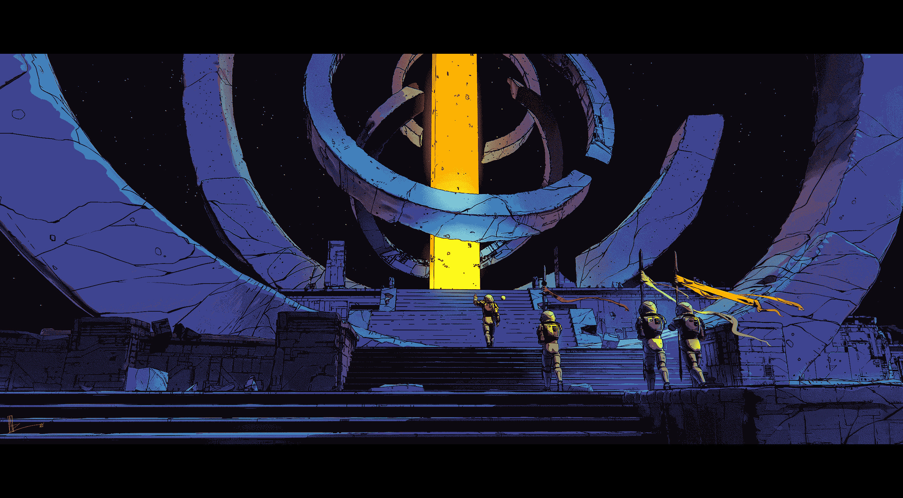
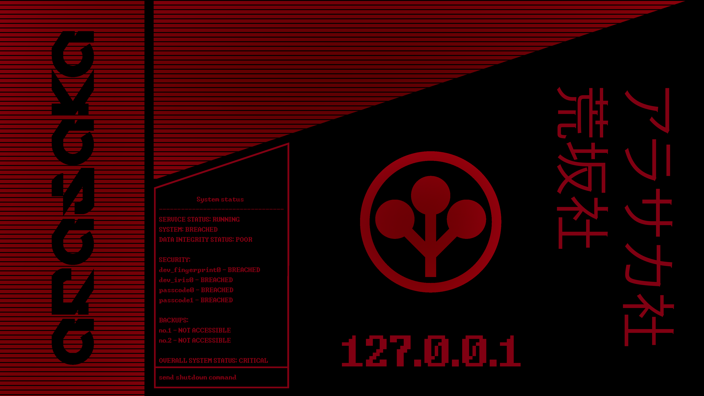

Welcome to the first post. This blog is an engineering log — a place to write
about systems, compilers, and the craft of building software.

## What this site is

A static blog with a build-time content pipeline:

1. Markdown lives in `content/raw/`.
2. A compiler turns it into structured, highlighted HTML.
3. Next.js renders it as static pages.

## A code sample

```ts
type Post = {
  readonly slug: string;
  readonly body: string;
};

const render = (post: Post): string => `<article>${post.body}</article>`;
```



## A table

| Feature             | Status |
| ------------------- | ------ |
| SSG                 | done   |
| Syntax highlighting | done   |

## Lists

Ordered lists carry their own numbering:

1. Write the post in markdown.
2. The compiler parses, highlights, and indexes it.
3. Next.js bakes it into static HTML.

Unordered lists nest, and each level keeps its own marker:

- Content lives next to the post
  - `hello-world.md` in `content/raw/`
  - images and fonts beside it
- Code is highlighted at build time
  - zero runtime JS
  - one Shiki theme, green-mono


## Quotes

Blockquotes get a phosphor rail so they read as spoken, not authored:

> Compilers are the closest thing software has to a mirror — they show you what
> you actually wrote, not what you meant to write.

Quote inside a quote keeps its own rail:

> A common saying around here:
>
> > A static blog is a blog that never 500s.

That's it for now. `[ read more ]` later.
